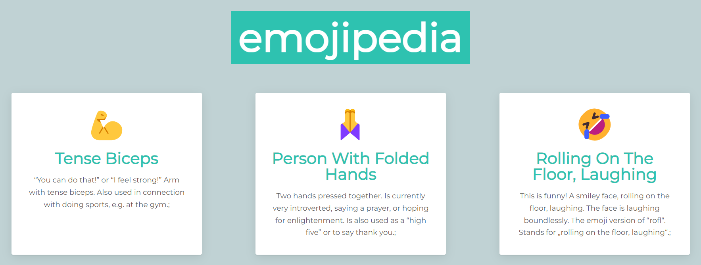

<h1 align="center">💪 🙏 🤣 Emojipedia</h1>
  
Project for practise of mapping data to components.

 
 

## What is this project about?
This is an emoji dictionary that helps in knowing what emojis actually mean.

## Technologies used
- HTML
- CSS
- JavaScript
- GIT
- Node.js
- React

 

## What have I learned?
- mapping data to components,
- <dl>: The Description List element.

 
 

*project is based on [Web Development Course](https://www.udemy.com/course/the-complete-web-development-bootcamp/)
